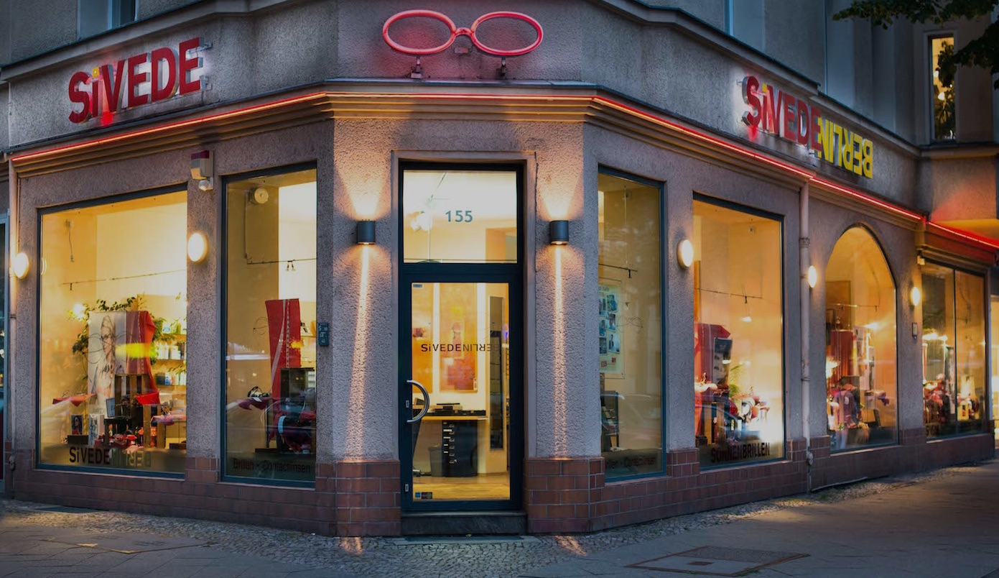

<nav class="fixed">
	<ul>
		<li><a href="#store"   class="icon fa-long-arrow-down">Store</a></li>
		<li><a href="#technic" class="icon fa-wrench">Technik</a></li>
	  <!-- <li><a href="#glasses" class="icon fa-search">Brillengläser</a></li> -->
		<li><a href="#lenses"  class="icon fa-eye">Kontaktlinsen</a></li>
	  <li><a href="#brands"  class="icon fa-search">Marken</a></li>
	  <li><a href="#window"  class="icon fa-windows">Schaufenster</a></li>
		<li><a href="#maps"    class="icon fa-envelope">Kontakt</a></li>
	</ul>
</nav>
<section id="one">
<h1 class="align-center">Herzlich Willkommen bei SiVEDE Augenoptik!</h1>
<h2 class="align-center">Besuchen Sie unser Augenoptik-Fachgeschäft.... Unsere Visitenkarte steht für klare modische Brillen. 
Lassen Sie sich inspirieren von modernen Ideen, zeitlosem Luxus und exklusiven Brillenfassungen.
</h2>
<h3 class="align-center">Wir führen zahlreiche nationale und internationale Brillenmarken. Von der stylischen Designerbrille bis zur handgefertigten Büffelhornbrille. </h3>

</section>

<section id="store">
	<h2>Unser Laden &mdash; Ihr Service</h2>
	
	<!-- Weitere Bilder in der Galerie -->
	

		
	

	
Unsere qualitativ hochwertige, selbstbewusste Auswahl an Korrektionsfassungen und Sonnenbrillen verleiht Ihnen einen unverwechselbaren, individuellen Stil &mdash; ob klassich, modebewusst oder glamourös.

	
Als Fachexperten stehen wir Ihnen in allen Belangen zur Seite und holen dank neuester Spitzentechnologie zur Vermessung der Augen das Optimum für Sie und Ihre Sehanforderungen heraus.

	<h2 id="technic">Unsere Technik</h2>
	
	
Unser Geschäft verfügt über das neue, hochpräzise und hochauflösende Messgerät <em>DNEye Scanner</em> von Rodenstock. Nebe der exakten Brillenglasbestimmung für Ferne und Nähe ermittelt der <em>DNEye Scanner</em> auch die Abbildungsfehler des Auges bei individueller Pupillengröße &mdash; für die 100%ige Ausschöpfung Ihres persönlichen Sehpotentials. Bei Bedarf messen wir damit zum Beispiel 	auch Ihre Nachtkurzsichtigkeit.

	
Daher können wir exzellente Brillengläser genau für Sie und Ihre Sehanforderungen anfertigen.

	<h2 id="lenses">Kontaktlinsen</h2>
	
	
Haben Sie Ihre Brille manchmal satt? Wünschen Sie sich mehr Freiheit? Treiben Sie Sport?

	
Wir erfüllen Ihre individuellen Wünsche &mdash; mit Tages-, Monats- oder Jahreslinsen. Wir beraten Sie gern und passen die Kontaktlinsen individuell an. Durch die hochpräzise Vermessung der Hornhaut mit dem <em>DNEyr Scanner</em> von Rodenstock erstellen wir eine Art "Landkarte" Ihrer Hornhaut, die bei jedem Menschen einzigartig ist. Daher müssen auch Kontaktlinsen immer nach Ihren individuellen Parametern ausgesucht und anprobiert werden.

	
Vertrauen Sie unseren Fachkenntnissen im Bereich Kontaktlinsenanpassung.  Mit individueller Materialauswahl garantieren wir gesundes Tragen Ihrer Kontaktlinsen &mdash; das gilt für Tages- und Monatslinsen sowie Speziallinsen für Astigmatismus (torisch) und zum Kompensieren der Altersichtigkeit (multifokal).

</section>
<section id="brands">
	

	

		

		

		

		

	

  

		

		

		

		

	

	

		

		

		

		

	

	

		

		

		

		

	

	

		
&nbsp;

		

		

		
&nbsp;

	

</section>

<section id="window" class="wow fadeIn">
	<h2>Unser aktuelles Schaufenster</h2>
	

		
<!-- 
Angebot
-->

		
<!--
Angebot 2
-->

		
<!--
Angebot 3
-->

		
<!--
Angebot 4
-->

	

</section>

<section id="maps" class="wow fadeIn">
 

	<h2>Besuchen Sie uns</h2>
		
Es gibt viele gute Gründe, persönlich vorbeizuschauen. Lassen Sie vorsorglich Ihre Augen und den Sitz Ihrer alten Brille überprüfen oder sich einfach von unseren neuen Brillen inspirieren.

    

			<iframe src="https://www.google.com/maps/embed?pb=!1m18!1m12!1m3!1d9715.76829556531!2d13.324670915344218!3d52.49828813664044!2m3!1f0!2f0!3f0!3m2!1i1024!2i768!4f13.1!3m3!1m2!1s0x47a850fa0ec4ceed%3A0x5a48949ecf5364c3!2sSivede+Augenoptik!5e0!3m2!1sde!2sde!4v1418805179638" width="600" height="450" frameborder="0" style="border:0;width:100% !important;min-height:450px;height:auto !important;border-radius:0.35em;"></iframe>
		
  
	 

</section>		
